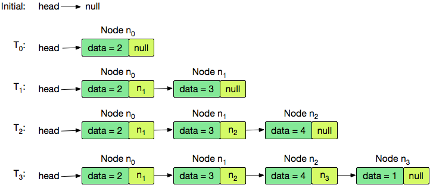

# Data structure (Estructuras de datos)
* Is a particular way to data organize in a computer to be used efficiently.
* Especially to management big data information as databases. 

## Queue (Cola | Fila)
Is a sequence of elements in which the operation of insert (enqueue) is done at one end (`back`) and the operation of extraction (dequeue) for the other (`front`).
* Mode of access is FIFO - `First in, First out`

### Basic methods
* constructor
* enqueue
* dequeue
* getSize
* isEmpty
* peek
* print

## Stack (Pila)
Is an ordered list of data which enables to save and get data
* Mode of access is LIFO - `Last in, First out`
 

### Basic methods
* constructor
* push
* pop
* getSize
* isEmpty
* peek
* print

## Linked list (Lista enlazada)
Is a `linear collection` constituted by sequence of `nodes` where they are stored data fields arbitrary and a reference of the next node.

### Basic methods
* Node constructor
* LinkedList constructor
* add
* insertAt
* removeFrom
* removeElement
* isEmpty
* getSize
* print

## Doubly Linked List (Lista doblemente enlazada)

## Hash table (Tabla hash)

## Difference between to array
The problem is to remove element of array, the array require passing indexation of all elements, and it is inefficient.    

